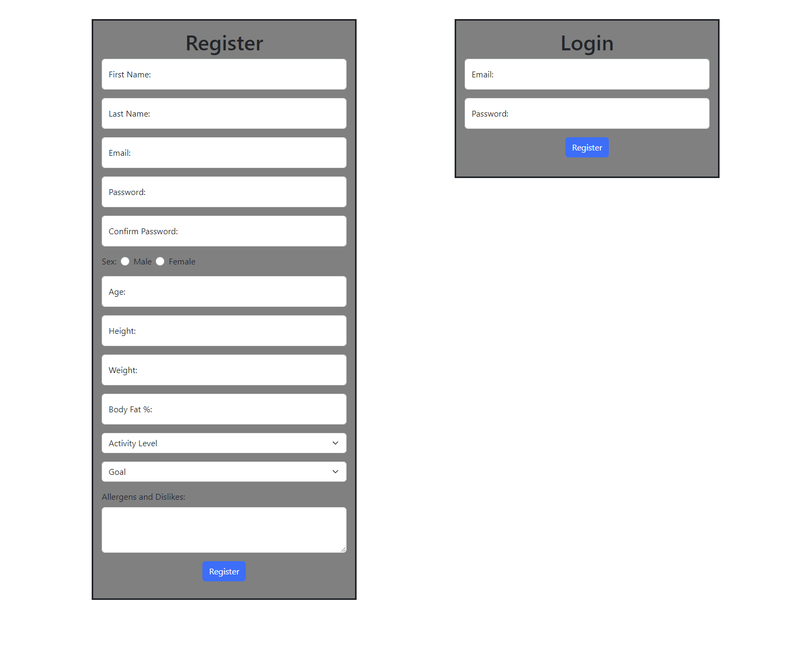
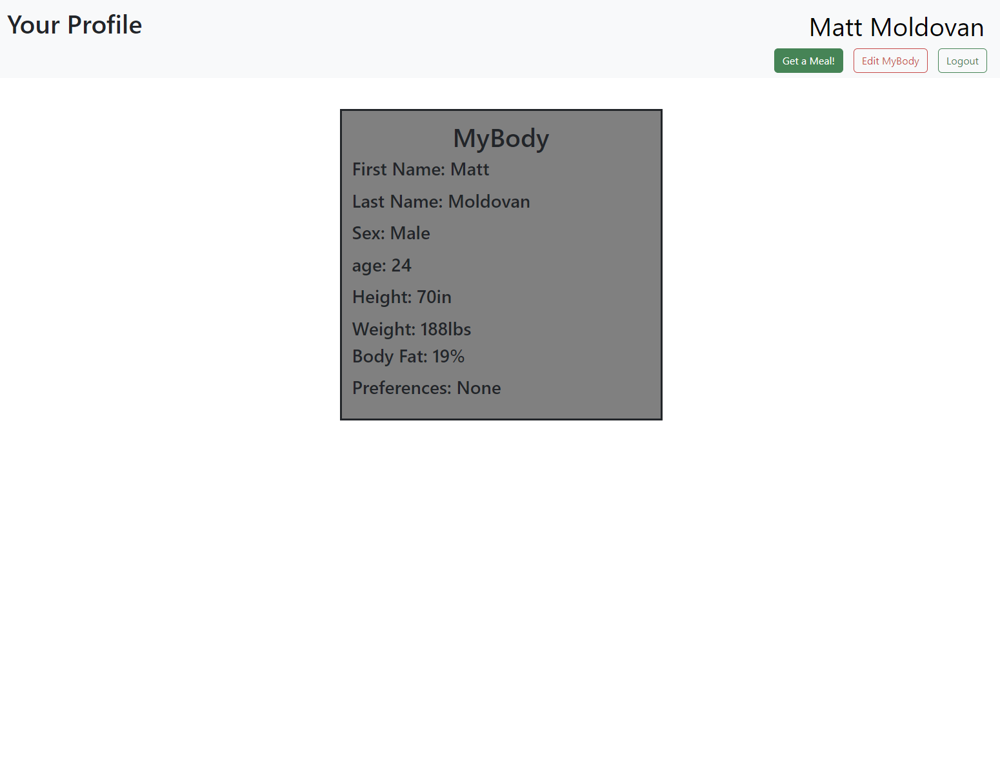
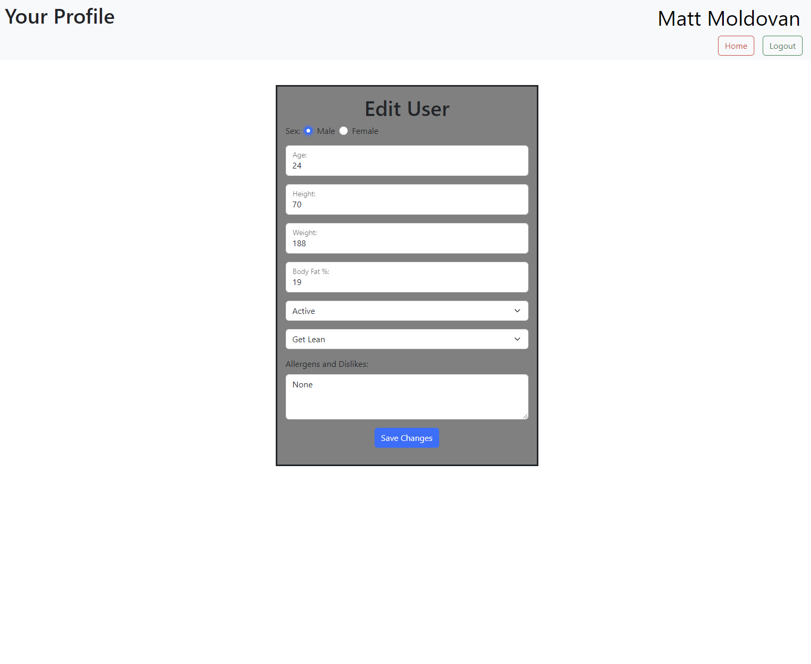
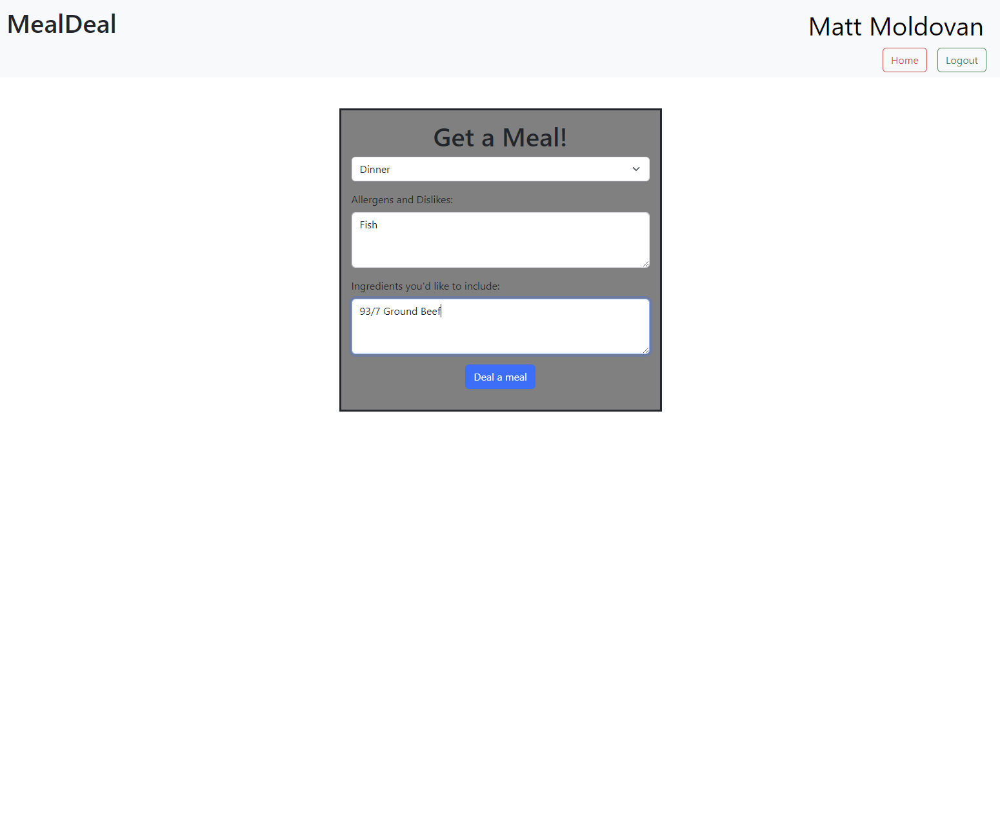
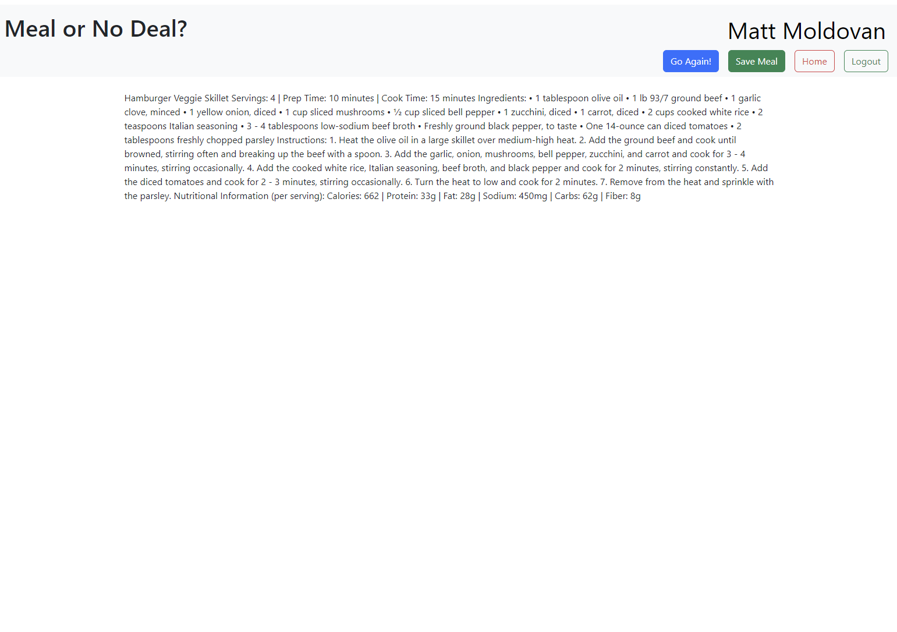

# Meal Deal
This project utilizes Python to develop a full-stack web application with the integration of ChatGPT3 to provide dynamic and personalized meals and recipes including nutritional breakdowns, ingredient lists, and cooking instructions.

## About
MealDeal was developed using Python, Flask, OpenAi ChatGPT3, Jinja, PyMySQL, Bcrypt, and Regex. The application takes in data provided by the user such as age, weight, height, gender, body fat percentage, goals, and allergens. Using the data provided by the user and MealDeal's integrated nutritional calculator the application will generate a suggested daily caloric intake for the user. Utilizing OpenAi's ChatGPT3 allows MealDeal to produce meal recipes for breakfast, lunch, dinner, and snacks that are condusive to the users needs and goals at the click of a button. Additionally, the user is able to specify ingredients they may already have to be included in the provided meal.

## Technologies Used
- Python
- Flask
- OpenAI's ChatGPT3
- Jinja
- PyMySQL
- Bcrypt
- RegEx
- HTML
- CSS
- Bootstrap
- jQuery

## Key Features
- Dynamic production of meal recipes that are condusive to a user's goals and body
- Imbedded nutritional calculator to assist users with nutritional planning 
- Secured login and registration with Bcrypt and RegEx

## Source Code
GitHub Repository: https://github.com/MatthewJMoldovan/MealDeal

## Skills Highlight
- Artificial Intelligence (AI)
- Web Development
- Programming
- Software Development
- SQL
- Flask
- ChatGPT3
- Python (Programming Language)
- Web Applications

## Tour of the Application 

1. Secure Login & Registration Screen using Bcrypt

2. User Profile Page

3. Edit Profile Page

4. Deal a Meal

5. View Dealt Meal

MealDeal is currently at the MVP stage of it's production. Future plans for the application include the ability to save previous meals, implentation of body fat percentage API, UI updates and revisions and more.

For more detailed instructions and additional information, please refer to the project's GitHub repository.